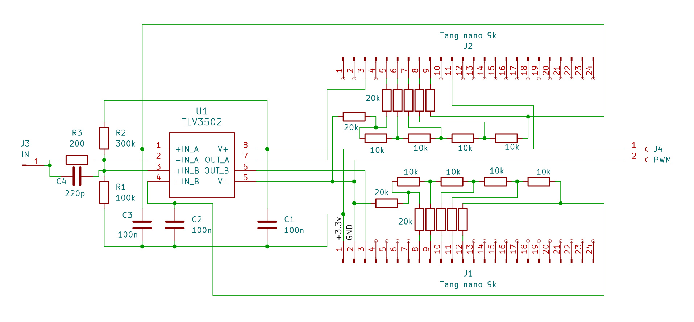

# Logic probe project using Tiny32 RISC-V CPU

## Components: Tang nano 9k board, SPI-LCD, r-2r resistor networks, TLV3502 high speed comparator.

## Features:
- Logic evel detection (one, zero, z)
- Pulse detection
- 3 frequency counters:
  - from high-level comparator output
  - from low-level comparator output
  - from rs-trigger that is connected to comparator outputs
- Duty cycle measurement for high, z and low signal levels.
- Adjustable high and low level comparator reference voltages:
  - for low level comparator: 0.1, 0.2, 0.3, 0.4, 0.8 v (default is 0.4v)
  - for high level comparator: 0.9, 1.0, 1.5, 2.0, 2.4 v (default is 2.0v)
- PWM generator with 105 MHz clock
- PWM and DAC control using USB-UART and command line interface

## Schematic diagram

## Device photo

